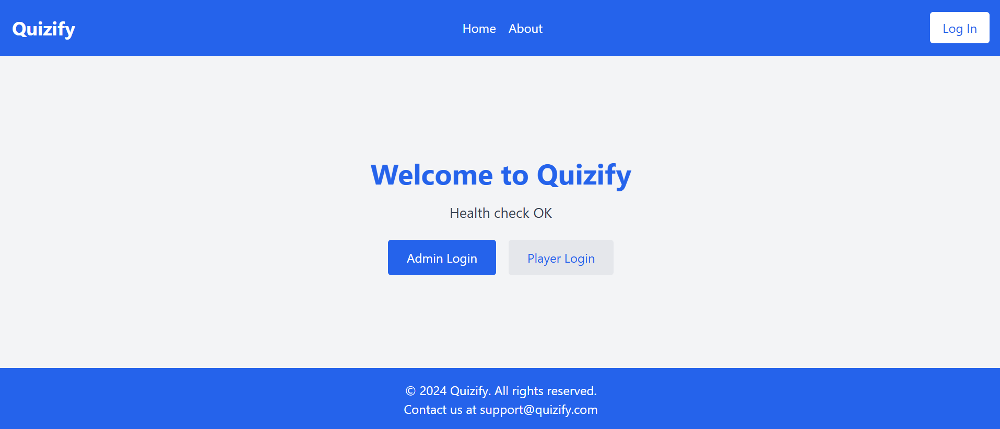

# Quizify

Quizify is a full-stack web application that allows users to create and participate in quizzes. The project is built using a microservices architecture with separate frontend and backend services connected to a PostgreSQL database. The project includes:

- **Backend**: Actix Web (Rust) for a robust and efficient API server.
- **Frontend**: ReactJS with Tailwind CSS for a modern and responsive UI.
- **Database**: PostgreSQL for storing quiz data and user information.
- **Docker**: Containerized services for easy deployment and development.

## Table of Contents

1. [Features](#features)
2. [Project Structure](#project-structure)
3. [Installation](#installation)
4. [Running the Project](#running-the-project)
5. [API Endpoints](#api-endpoints)
6. [Environment Variables](#environment-variables)
7. [Technologies Used](#technologies-used)
8. [Contributing](#contributing)
9. [License](#license)

## Features

- **Admin Role**:
  - Create, update, and delete quizzes.
  - Add, edit, or remove questions within quizzes.
  - View quiz analytics and user activity.

- **Player Role**:
  - Browse and participate in quizzes.
  - View detailed results and performance history.

- **General**:
  - Role-Based Access Control (RBAC).
  - Secure authentication using JWT tokens.
  - Timer-based quizzes with randomized questions.

## Project Structure

```
Quizify_Application/
├── quizify-backend/     # Backend service
│   ├── src/             # Rust source code
│   └── Dockerfile       # Dockerfile for the backend
├── quizify-frontend/    # Frontend service
│   ├── src/             # React source code
│   └── Dockerfile       # Dockerfile for the frontend
├── docker-compose.yml   # Docker Compose configuration
└── README.md            # Project documentation
```

## Screenshots

### Home Page


### Quiz Creation (Admin)


### Quiz Participation (Player)


## Installation

### Prerequisites

- [Docker](https://www.docker.com/) (for running containers)
- [Node.js](https://nodejs.org/) v23.1.0 or later (for frontend development)
- [Rust](https://www.rust-lang.org/) (for backend development)

### Clone the Repository

```bash
git clone https://github.com/NoManNayeem/Quizify.git
cd Quizify
```

## Running the Project

### Using Docker Compose

1. Build and start all services:
   ```bash
   docker-compose up --build
   ```

2. Access the services:
   - **Frontend**: [http://localhost:3000](http://localhost:3000)
   - **Backend Health Check**: [http://localhost:8080/health](http://localhost:8080/health)

3. Connect to the database:
   - Host: `localhost`
   - Port: `5432`
   - User: `quizify`
   - Password: `quizify123`
   - Database: `quizify`

### Local Development

#### Backend
1. Navigate to the backend directory:
   ```bash
   cd quizify-backend
   ```
2. Run the backend:
   ```bash
   cargo run
   ```

#### Frontend
1. Navigate to the frontend directory:
   ```bash
   cd quizify-frontend
   ```
2. Install dependencies and start the development server:
   ```bash
   npm install
   npm start
   ```

## API Endpoints

### Public Endpoints
- **GET** `/health` - Health check for the backend.

### Admin Endpoints
- **POST** `/admin/quiz` - Create a new quiz.
- **PUT** `/admin/quiz/:id` - Update an existing quiz.

### Player Endpoints
- **GET** `/player/quiz` - Fetch available quizzes.

## Environment Variables

Create `.env` files in both the `quizify-backend` and `quizify-frontend` directories.

### Backend `.env`

```env
DATABASE_URL=postgres://quizify:quizify123@db/quizify
RUST_LOG=info
HOST=0.0.0.0
PORT=8080
```

### Frontend `.env`

```env
REACT_APP_API_URL=http://localhost:8080
```

## Technologies Used

- **Backend**: Rust, Actix Web, PostgreSQL
- **Frontend**: ReactJS, Tailwind CSS
- **Containerization**: Docker, Docker Compose

## Contributing

Contributions are welcome! Please follow these steps:

1. Fork the repository.
2. Create a new branch (`git checkout -b feature-name`).
3. Commit your changes (`git commit -m 'Add some feature'`).
4. Push to the branch (`git push origin feature-name`).
5. Open a pull request.

## License

This project is licensed under the MIT License. See the `LICENSE` file for details.
